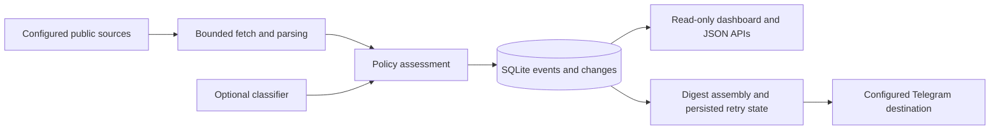

# Engineering walkthrough

EventFinder is a local, read-only discovery service. Its engineering focus is preserving source evidence while isolating failed sources and tracking delivery outcomes.



## Decisions worth inspecting

- **Source failures are isolated.** URL/DNS checks, robots/access boundaries, per-source cadence, and bounded hydration live in the source-fetching path. A denied or changed source does not establish that no events exist elsewhere. Start with [`sources.py`](../eventfinder/sources.py) and [`urls.py`](../eventfinder/urls.py).
- **Classification preserves provenance.** Parsing supplies event facts. Policy evaluates them; optional AI classifies ambiguity without supplying missing facts. Ambiguous candidates remain reviewable. See [`policy.py`](../eventfinder/policy.py) and [`ai.py`](../eventfinder/ai.py).
- **Delivery state survives retries.** Saved digest chunks retain their message bodies and associated event changes. Successfully delivered chunks remain complete when another chunk must be retried. See [`telegram.py`](../eventfinder/telegram.py) and [`repository.py`](../eventfinder/repository.py).
- **The dashboard is read-only.** Date filters use whole IST days, and health reports expose source coverage rather than using a single successful source as a complete-health verdict. See [`web.py`](../eventfinder/web.py).

## Try the pipeline without accounts

```sh
make install
make smoke
make test
```

The existing smoke command exercises assessment, temporary SQLite persistence, and event listing using a synthetic event. It does not fetch sources, start the persistent service, call a model, or send Telegram. Tests use fixtures and mocked transports.

## Validation boundaries

Offline tests and smoke checks verify local behavior. They do not establish current source availability, Telegram delivery, or the status of a user's installed LaunchAgent. Configure and verify those separately for a real deployment. Fixture URLs and sample events are demonstration data, not advertised events.
